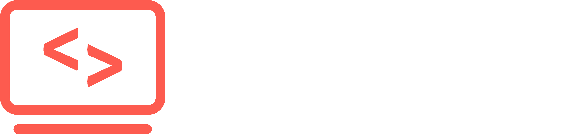
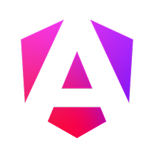

  

  👋 Hi! I'm Kevin — a physicist by mindset, a developer by passion. I love breaking down complexity into clear, intuitive code.
    
  As Head of Mentoring and Content at the Developer Akademie, I support learners not only through guidance, but by crafting hands-on learning material that turns theory into practical skill.
    
  My drive? Making knowledge accessible — whether it's through a clean interface, a great codebase, or a well-structured lesson.

###
##  Developer Akademie

<table >
  <tr>
    <td></td>
    <td style="padding-left: 12px;">
      Head of Mentoring 
      Developer Akademie
    </td>
  </tr>
</table>

## Preferred Tech Stack

<h3> Frontend</h3>

  
  
  
  
  
  

<h3> Backend</h3>

  
  
  

<h3> Dev-Tools</h3>

  
  
  

###

##  GitHub Stats

  
  

###

##  SNAKE!

###

##  Kontakt

  

  

###
